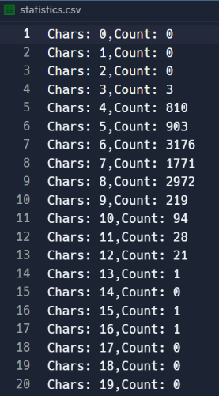

# PRG1-pair-programming-PWstats

1. Take your time to read and understand the code. Explain lines in turn to your partner.

2. Count the number of occurrences of the different lengths of the 10000 passwords and store the results in the outputFile (statistics.csv). Here’s a sample output that you are aiming for:

    

   Have a think about it first (seriously!!), but if you want a hint, scroll down to the bottom.

4. What other statistics might you be able to calculate?
    - Number of passwords beginning with A? A through to Z?
    - Number of passwords starting with a number?
    - What else?
  
*
*
*
*
*
*
*
*
*
*
*
*
*
*
*
*
*
*
*
*
*
*
*
*
*
*
*
*
*
*
*
*
*
*
*
*
*
*
*
*
*
*
*
*
*
*
*
*
*
*
*
*
*
*
*
*
*
*
*
*
*
*
*
*
*
*
*
*
*
*
*
*
*
*
*
*
*
*
*
*
*
*
*
*
*
*
*
*
*
*
*
*
*
*
*
*
*
*
*
*
*
*
*
*
*
*
*
*
*
*
*
*
*
*
*
*
*
*
*
*
*
*
*
*
*
*
*
*
*
*
*
*


### 

A data structure to store the counts in would be good. An object would work (with the keys being different password lengths 1-20), or you could use an array, which is what I did. ```let lengths = new Array(20).fill(0)```. This creates an array with 20 locations, each initialised to 0.


